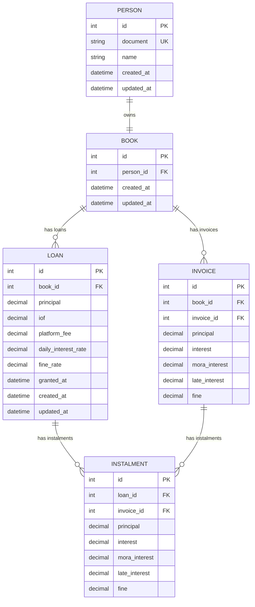

```mermaid
erDiagram
    PERSON ||--|| BOOK : owns
    BOOK ||--o{ LOAN : "has loans"
    BOOK ||--o{ INVOICE : "has invoices"
    LOAN ||--o{ INSTALMENT: "has instalments"
    INVOICE ||--o{ INSTALMENT: "has instalments"

    PERSON {
        int id PK
        string document UK
        string name
        datetime created_at
        datetime updated_at
    }

    BOOK {
        int id PK
        int person_id FK
        datetime created_at
        datetime updated_at
    }

    LOAN {
        int id PK
        int book_id FK
        decimal principal
        decimal iof
        decimal platform_fee
        decimal daily_interest_rate
        decimal fine_rate
        datetime granted_at
        datetime created_at
        datetime updated_at
    }

    INSTALMENT {
        int id PK
        int loan_id FK
        int invoice_id FK
        decimal principal
        decimal interest
        decimal mora_interest
        decimal late_interest
        decimal fine
    }

    INVOICE {
        int id PK
        int book_id FK
        int invoice_id FK
        decimal principal
        decimal interest
        decimal mora_interest
        decimal late_interest
        decimal fine
    }
```
